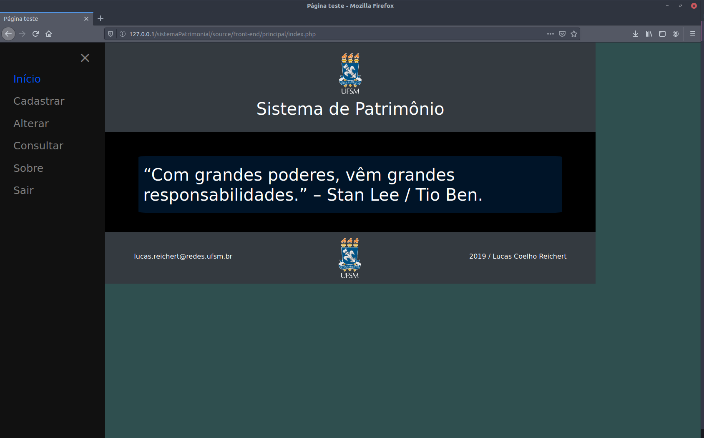
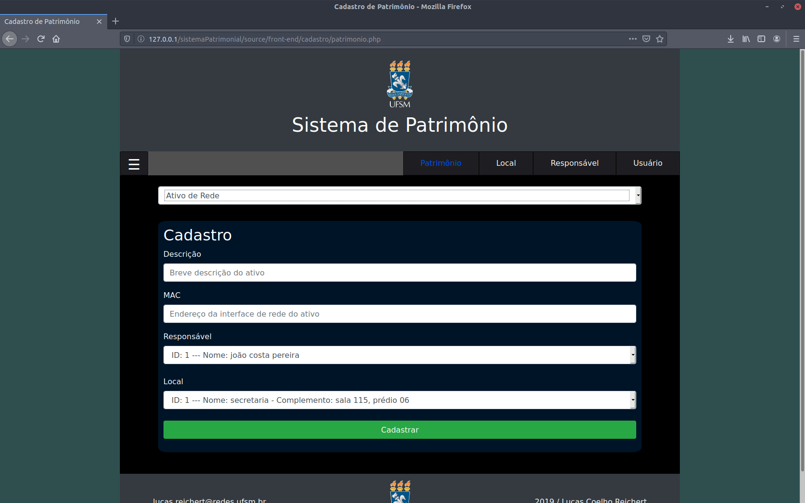
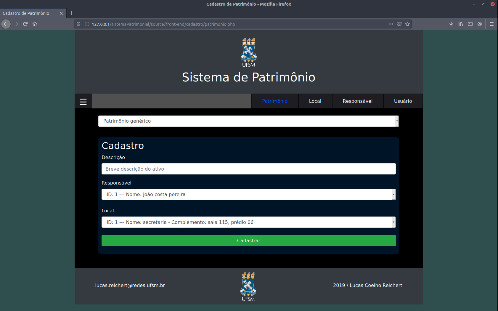
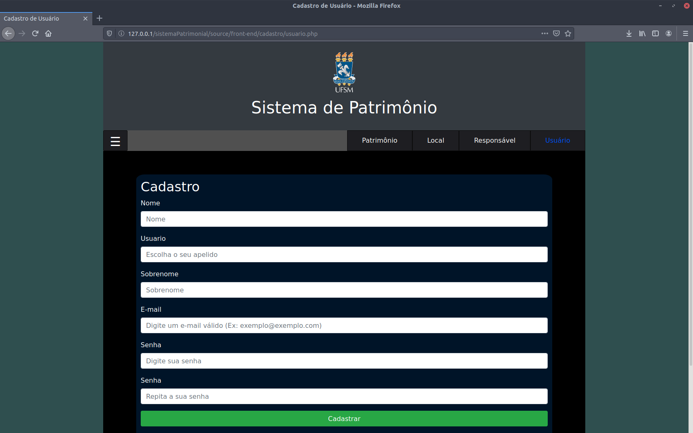
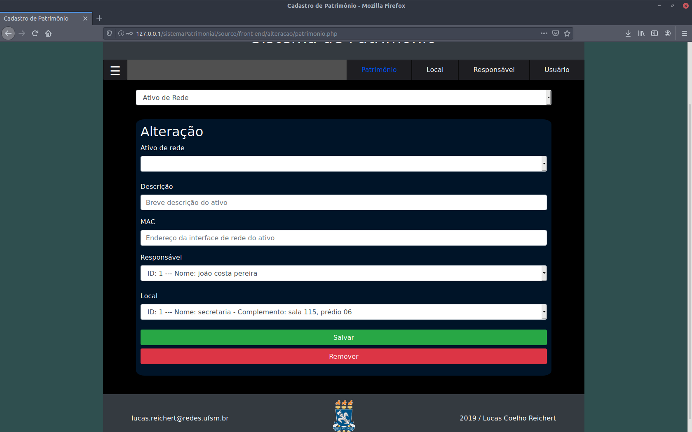
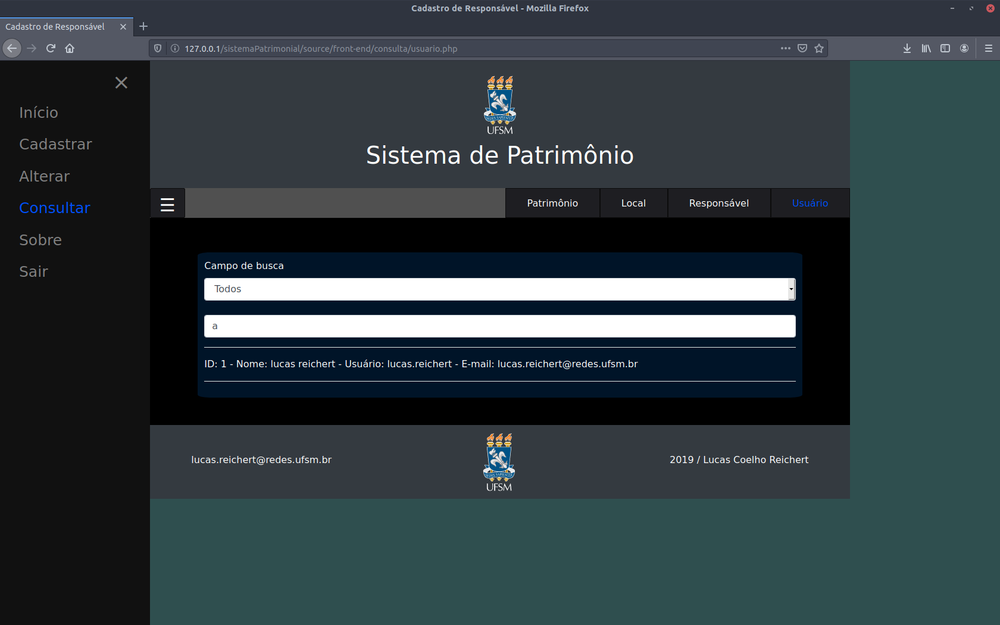
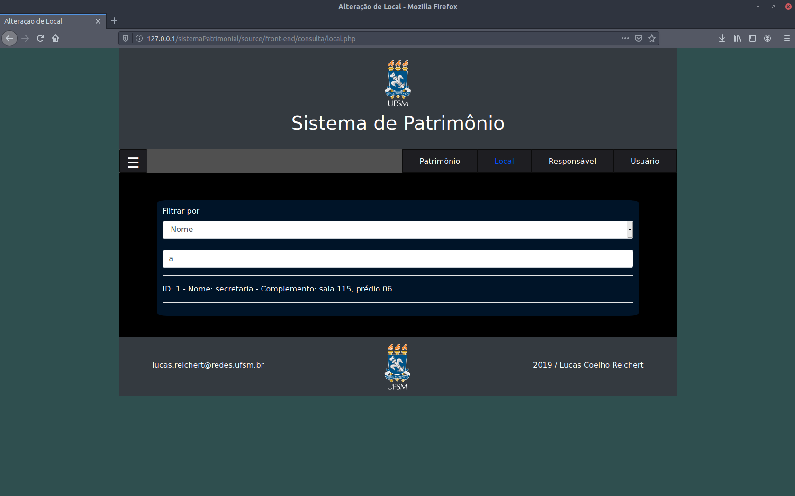

# Sistema Patrimonial
Sistema desenvolvido para um controle patrimonial efetivo, incluindo o cadastro de locais, responsáveis, usuários (administradores do sistema), e alguns patrimônios como: ativos de rede, móveis, entre outros mais genéricos. Além disso, o sistema faz o controle de sessões, fazendo com que apenas usuários previamente cadastrados, possam acessar as telas do sistema e realizar a gerência e consulta de patrimônios. O sistema também conta com um menu dropdown para navegar entre as principais partes do sistema e um menu superior que é específico para cada segmento do sistema. 
  
Para o desenvolvimento do sistema foi utilizado o SGBD MySQL; as linguagens PHP, JavaScript, HTML, CSS; além do framework Bootstrap.

# Algumas Telas do Sistema
## Desktop

  
  
  
  
  
  
    
  

